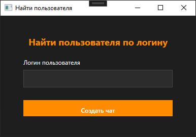
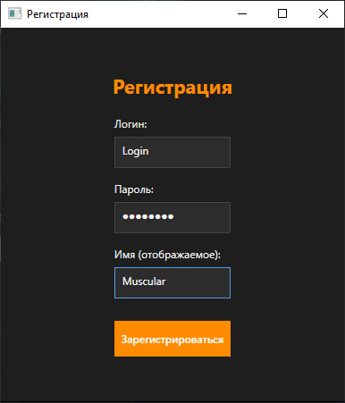
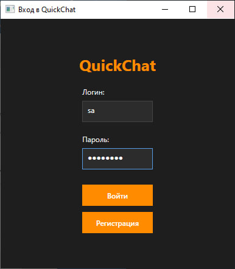

# 💬 QuickChat


> Простое и современное десктопное приложение для общения: приватные чаты, статусы онлайн, моментальная доставка сообщений и чистый интерфейс.

---

## ⚙️ Технологии

**Клиент (WPF)**
- .NET 8
- WPF (MVVM-подход)
- SignalR Client
- HttpClient (REST)
- Кэш сообщений в памяти

**Сервер (ASP.NET Core)**
- ASP.NET Core Web API
- SignalR
- Entity Framework Core
- PostgreSQL
- Dependency Injection
- CORS + HTTPS

---
🖼 Скриншоты

Интерфейс чата


Поиск Друга!


Пример окна регистрации

Пример окна входа

---
## ✨ Возможности

- Регистрация и вход с логином
- Создание приватных чатов
- Отправка сообщений в реальном времени
- Статус онлайн/офлайн у пользователей
- История сообщений хранится на сервере
- Аватарки и цветовые метки пользователей
- Автопрокрутка вниз при открытии чата и новых сообщениях
- Enter — отправка сообщения, Ctrl+Enter — новая строка


## 🧱 Структура проекта
---
QuickChat/
├── QuickChat.API/ # Сервер
│ ├── Controllers/ # REST API
│ ├── SignalR/ # Хабы и группы
│ ├── Models/ # DTO и модели БД
│ └── Program.cs
│
├── QuickChat.Client/ # WPF-клиент
│ ├── Views/ # XAML окна
│ ├── Models/ # Данные сообщений и чатов
│ ├── Services/ # ApiService, ChatService и т.д.
│ └── MainWindow.xaml # Основное окно чата
---

## 🐘 Настройка PostgreSQL

1. Установи PostgreSQL и создай базу `quickchatdb`
2. Измени строку подключения в `appsettings.json`:
   ```json
   "ConnectionStrings": {
     "DefaultConnection": "Host=localhost;Port=5432;Database=quickchatdb;Username=postgres;Password=твой_пароль"
   }


🧑‍💻 Автор
Разработано с 💻 и ⚡ в условиях дедлайна.
Автор: @Timoshkins1

Если проект оказался полезен — поддержи звёздочкой ⭐ на GitHub!
